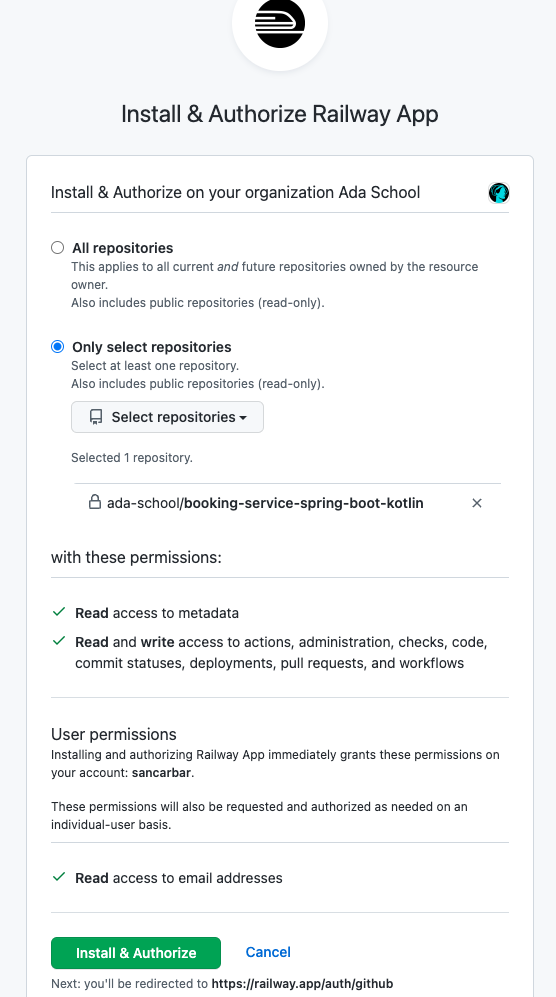
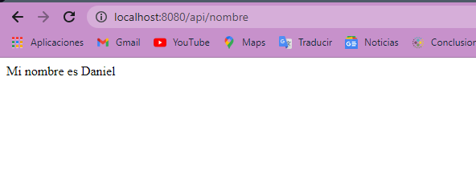

# Despliegue App Spring Boot con Github y Raylway.app


1. Implementa un microservicio REST con Spring Boot que envíe como respuesta tu nombre.

2. Crea un nuevo repositorio en Github y sube el código de tu proyecto.

3. Crea una cuenta usando Github Raylway.app



4. Conecta tu cuenta de Github con Raylway.app.


# Como correrlo 

Copia el repositorio en una carpeta local 

```
git clone https://github.com/DanielBuilesG/Despliegue-App-Spring-Boot-con-Github-y-Raylway.app.git
```

Basta con correr la clase main del proyecto e ir al siguiente enlace 
```
http://localhost:8080/api/nombre
```


# Funcionamiento 


Al correr la aplicacion de Spring Boot aparece lo siguiente en el navegador




# Deploy en Railway 

esta corriendo en railway el spring pero no me deja entrar por el URL 


